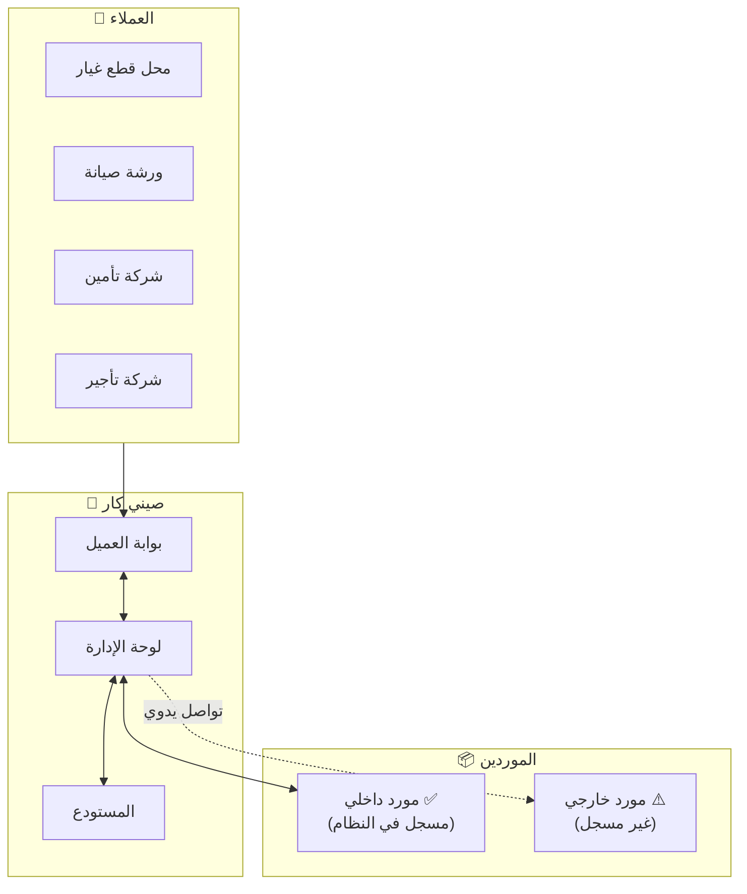
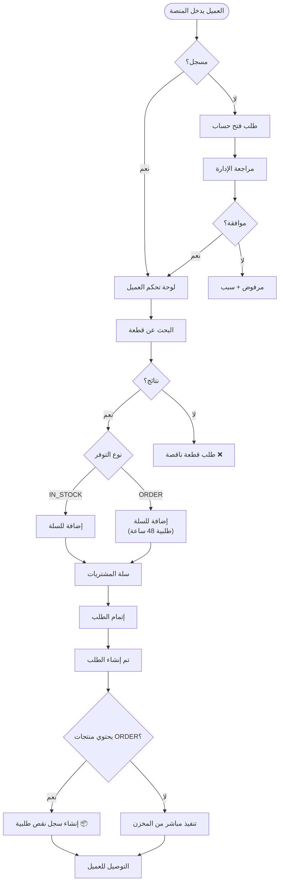
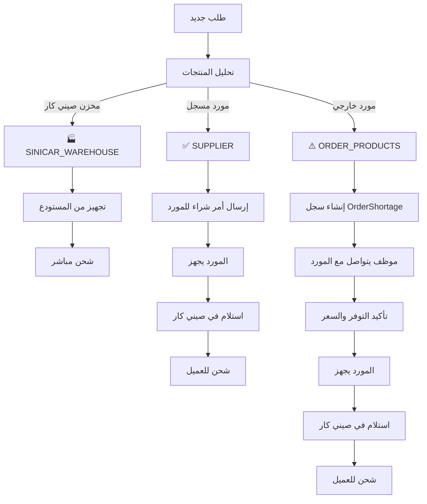
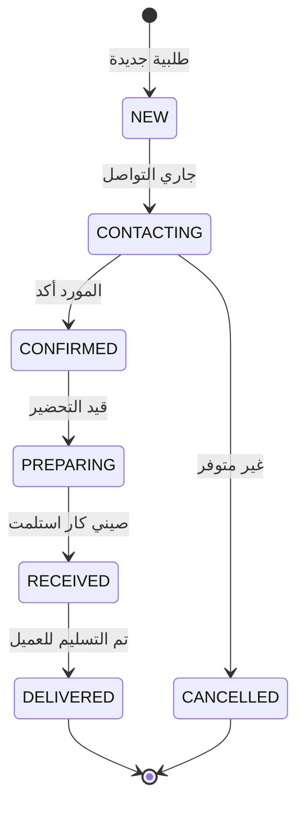

# 🏗️ هيكل نظام صيني كار الكامل

## 📌 نظرة عامة

نظام **صيني كار** هو منصة B2B لتجارة قطع غيار السيارات الصينية بالجملة. يربط بين:
- **العملاء** (محلات، ورش، شركات تأجير، شركات تأمين)
- **الموردين الداخليين** (مسجلين في النظام)
- **الموردين الخارجيين** (غير مسجلين - تواصل يدوي)
- **إدارة صيني كار** (فريق العمل الداخلي)

---

## 🔄 المخطط الرئيسي للنظام



---

## 👤 رحلة العميل الكاملة



---

## 📦 أنواع الموردين

### المورد الداخلي (مسجل في النظام) ✅

| الخاصية | القيمة |
|---------|--------|
| `storageSection` | `'SUPPLIER'` |
| `supplierId` | معرف المورد في النظام |
| `availabilityType` | `'IN_STOCK'` عادةً |
| التواصل | تلقائي عبر النظام |
| أوامر الشراء | تظهر في بوابة المورد |

### المورد الخارجي (غير مسجل) ⚠️

| الخاصية | القيمة |
|---------|--------|
| `storageSection` | `'ORDER_PRODUCTS'` |
| `unregisteredSupplierName` | اسم المورد |
| `unregisteredSupplierContact` | رقم الجوال |
| `availabilityType` | `'ORDER'` |
| `deliveryHours` | وقت التوصيل (24، 48، 72...) |

---

## 🔀 تدفق الطلبات حسب مصدر المنتج



---

## 👨‍💼 صفحات الإدارة

| الصفحة | الغرض |
|--------|-------|
| **طلبات العملاء** | مراجعة وتنفيذ الطلبات |
| **طلبات الحسابات** | الموافقة على حسابات جديدة |
| **طلبات التسعير** | تسعير قوائم Excel |
| **النواقص** ❌ | البحث عن قطع غير موجودة |
| **نواقص الطلبيات** 📦 | متابعة موردين خارجيين |
| **المنتجات** | إضافة وتعديل المنتجات |
| **سوق الموردين** | إدارة الموردين المسجلين |

---

## 🔔 حالات نقص الطلبية (OrderShortage)



---

## 💰 معادلة التسعير

```
سعر البيع = سعر الشراء × (1 + هامش الربح / 100)
```

---

## ✅ ملخص الفروقات

| المفهوم | الوصف | الصفحة |
|---------|-------|--------|
| **مخزون صيني كار** | قطع في مستودع صيني كار | تُشحن مباشرة |
| **مورد داخلي** | مورد مسجل في النظام | بوابة الموردين |
| **مورد خارجي** | مورد غير مسجل | نواقص الطلبيات |
| **قطعة ناقصة** | قطعة غير موجودة في الكتالوج | النواقص |
| **طلبية** | قطعة موجودة لكن من مورد خارجي | نواقص الطلبيات |
